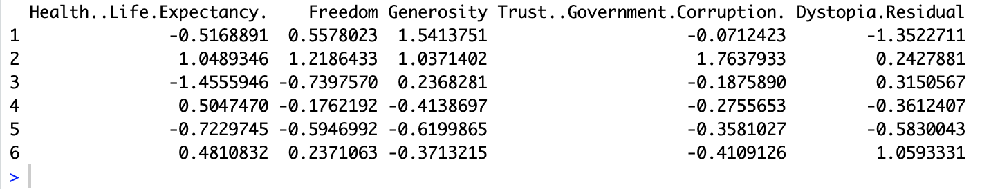
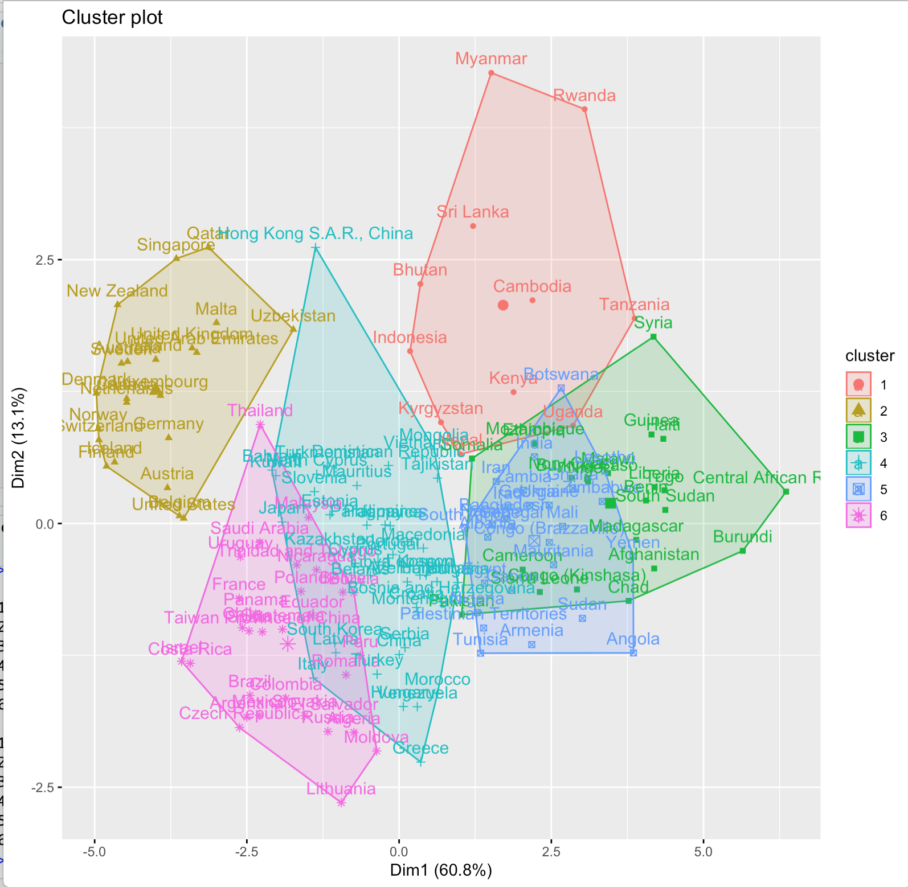

# DM_Cluster3CM9
Examen practico de la materia Data Mining sobre clustering realizado en R.

# Requerimientos 

Instalar R Studio.

# Código 

Todo viene en el archivo Happiness.R.

## Autores 

* **Ferrer Garcia Erick** - [ErickFerrer96](https://github.com/ErickFerrer96)

## Documentacion de Flutter usada en este proyecto

[Documentación de R](https://docs.rstudio.com)

## Galeria

|Index| Descripción | Imagen |
| ---| --- | --- |
| 1 | Parametros que toma en cuenta el clustering |  |
| 2 | Resultado de 6 clusters |  |
